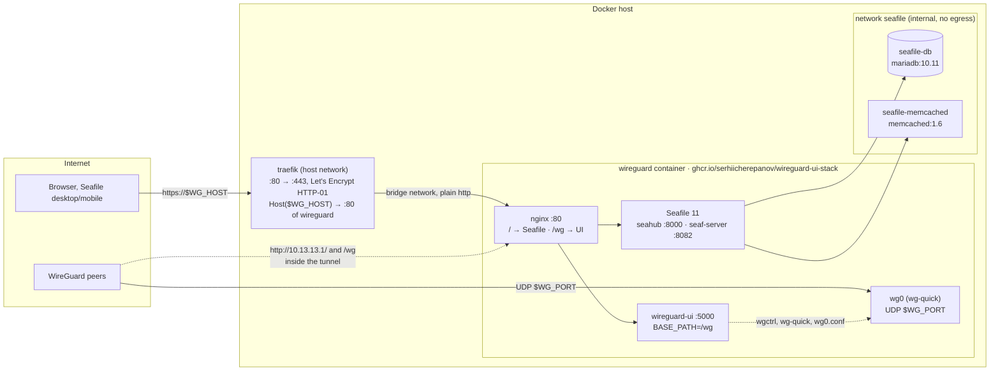

# WireGuard + WireGuard-UI (Skyline-core fork) + Traefik + Seafile

One container runs the WireGuard tunnel (`wg-quick`), the web UI and a Seafile CE server.
The UI sees the live interface and shows peer status (handshakes, transfer, connected/offline)
on its Status, Dashboard and Traffic pages. Traefik serves both on one domain: Seafile at
`https://$WG_HOST/`, the UI at `https://$WG_HOST/wg`.

The UI is the [Skyline-core fork of wireguard-ui](https://github.com/Skyline-core/wireguard-ui).
It publishes no image, so this repo builds its own: GitHub Actions builds `Dockerfile` on
every push to `main` and publishes `ghcr.io/serhiicherepanov/wireguard-ui-stack:latest`
(plus a `:sha-…` tag per commit). The server pulls it; `docker compose build` still works
for a local build.

Two compose files (one service `wireguard` = tunnel + UI + Seafile, container name `wireguard`):

- `docker-compose.yaml` — base: `wireguard` (UI fork + wg-quick + Seafile, `NET_ADMIN`), plus
  `seafile-db` (MariaDB) and `seafile-memcached` on an internal network. UI is bound to
  `$WGUI_BIND:$WGUI_PORT` (default `127.0.0.1:5000`), WireGuard on `$WG_PORT/udp`.
- `docker-compose.traefik.yaml` — optional overlay: Traefik on host network, :80/:443,
  Let's Encrypt via HTTP-01 challenge, sends `https://$WG_HOST` to the container's nginx
  (Seafile at `/`, UI at `/wg`).

## Services



Without the Traefik overlay, the container's nginx is published on `$HTTP_BIND:$HTTP_PORT`
(default `127.0.0.1:8080`); point your own TLS-terminating proxy at it and set
`SEAFILE_FORCE_HTTPS=true` before the first start.

Volumes: `wireguard/ui/db` (UI DB, server keypair) and `wireguard/config/wg_confs` (`wg0.conf`)
into `wireguard`; `seafile/data` (`/shared`) into `wireguard`; `seafile/db` into `seafile-db`;
`letsencrypt/acme.json` into `traefik`.

## Run

```
cp .env.example .env            # fill in values
docker compose pull wireguard   # CI-built image from GHCR (or: docker compose build)
docker compose up -d            # COMPOSE_FILE in .env includes the traefik overlay
```

Updating to the latest build: `docker compose pull wireguard && docker compose up -d`.
If the GHCR package is private, `docker login ghcr.io` with a token that has `read:packages`
first.

Without Traefik: drop `docker-compose.traefik.yaml` from `COMPOSE_FILE` in `.env`, or run
`docker compose -f docker-compose.yaml up -d`. Then proxy `https://$WG_HOST` to
`http://127.0.0.1:$HTTP_PORT` (nginx: Seafile at `/`, UI at `/wg`), forwarding `Host` and
`X-Forwarded-Proto`, and set `SEAFILE_FORCE_HTTPS=true` in `.env` before the first start.

- Seafile: `https://$WG_HOST/` (with traefik) or `http://<wg address>/` over the tunnel.
  First start takes a couple of minutes (DB setup); watch `docker compose logs -f wireguard`.
- UI: `https://$WG_HOST/wg` (with traefik), `http://<wg address>/wg` (through the tunnel) or
  `http://127.0.0.1:5000/wg` (on the host). The prefix is `WGUI_BASE_PATH`.
- Traefik dashboard: `https://$WG_HOST/traefik/dashboard/` (basic auth from `TRAEFIK_DASHBOARD_USERS`)
- WireGuard: `$WG_HOST:$WG_PORT/udp`

## Seafile

- Based on the [official Seafile CE docker setup](https://manual.seafile.com/11.0/docker/deploy_seafile_with_docker/):
  same image (`seafileltd/seafile-mc:11.0-latest`), same MariaDB/memcached companions, same
  environment variables. The difference is that the Seafile image is the base of the
  `wireguard` image (see `Dockerfile`) instead of a separate container.
- One domain for both: Traefik hands the whole domain to the nginx inside the container,
  which serves Seafile at `/` and proxies `/wg` to the UI. Seafile itself cannot live under a
  sub-path, which is why the UI is the one that moves. The same nginx split works over the
  tunnel without Traefik. Passkeys need HTTPS and therefore only work via the Traefik URL;
  password login works everywhere.
- TLS is terminated by Traefik. The overlay sets `FORCE_HTTPS_IN_CONF=true`, and the image
  patches Seafile's first-run bootstrap so that `seahub_settings.py` gets an https
  `SERVICE_URL` (the stock image writes http there despite the flag) and
  `CSRF_TRUSTED_ORIGINS` (Seafile 11 / Django 4 otherwise answers 403 to the login POST).
- `SEAFILE_HOST` is optional and defaults to `WG_HOST`. It, the admin account and
  `SEAFILE_DB_ROOT_PASSWORD` are read on the first start only. To change the host later edit
  `SERVICE_URL`, `FILE_SERVER_ROOT` and `CSRF_TRUSTED_ORIGINS` in
  `seafile/data/seafile/conf/seahub_settings.py`, delete
  `seafile/data/nginx/conf/seafile.nginx.conf` and restart. On a fresh install it is simpler
  to stop the stack, delete `seafile/data` and `seafile/db`, and start again.
- Clients (desktop sync, mobile) use `https://$WG_HOST`.

## How changes are applied

- Container start/stop: `wg-quick up/down` (`WGUI_MANAGE_START=true`).
- **Apply config** in the UI rewrites `wg0.conf` and restarts the tunnel with `wg-quick`
  (`WGUI_ALLOW_WG_QUICK=true`). That covers peers, AllowedIPs (kernel routes included),
  server address, port and PostUp/PostDown. Sessions drop for about a second and reconnect.
- The Server page has Stop / Start / Restart buttons.
- No cron or sidecar containers anymore.

HTTP-01 requires port 80 to be reachable from the internet on this host and `$WG_HOST` to
resolve to it. No DNS provider credentials are needed.

## Upgrading the fork

Change the `WGUI_FORK_REF` default in `docker-compose.yaml` to a new commit sha or tag and push
to `main`; CI publishes the new image. Then on the server:

```
docker compose pull wireguard && docker compose up -d
```

## State

- `wireguard/ui/db` — UI users, clients, server keypair, settings. **Source of truth.**
- `wireguard/config/wg_confs/wg0.conf` — rendered by the UI, read by wg-quick.
- `letsencrypt/acme.json` — certificates (must be mode 600)
- `seafile/data` — Seafile config, libraries, logs; `seafile/db` — MariaDB data

All of these are gitignored.

## Migrating from the previous linuxserver/wireguard + ofelia layout

Nothing to move: the UI DB and `wg_confs/wg0.conf` are mounted from the same paths. The old
`wireguard/config/{server,templates,coredns}` directories belonged to linuxserver/wireguard
and are no longer read; delete them when convenient. Run

```
docker compose down --remove-orphans   # stops old wireguard / ofelia containers
docker compose build && docker compose up -d
```
